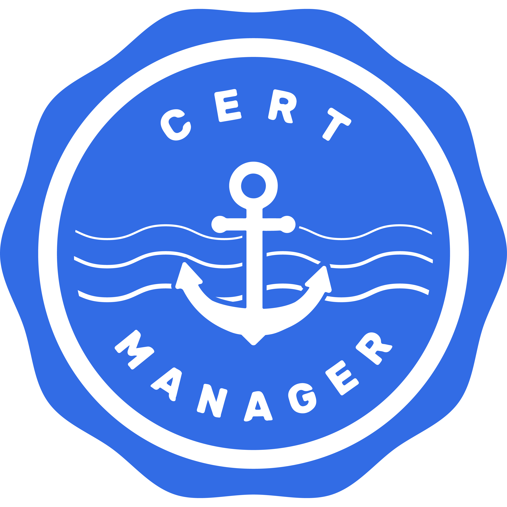

# Diagrams as Code

```py
from diagrams import Cluster, Diagram
from diagrams.custom import Custom
from urllib.request import urlretrieve

with Diagram("Import logo CertManager", show=False):

    with Cluster("This is a logo"):
        certmanager_url = "https://github.com/jetstack/cert-manager/raw/master/logo/logo.png"
        certmanager_icon = "logo.png"
        urlretrieve(certmanager_url, certmanager_icon)
        certmanager = Custom("Cert Manager", certmanager_icon)
```




```py
from diagrams import Cluster, Diagram
from diagrams.gcp.analytics import BigQuery, Dataflow, PubSub
from diagrams.gcp.compute import AppEngine, Functions
from diagrams.gcp.database import BigTable
from diagrams.gcp.iot import IotCore
from diagrams.gcp.storage import GCS

with Diagram("Message Collecting", show=False):
    pubsub = PubSub("pubsub")

    with Cluster("Source of Data"):
        [IotCore("core1"),
         IotCore("core2"),
         IotCore("core3")] >> pubsub

    with Cluster("Targets"):
        with Cluster("Data Flow"):
            flow = Dataflow("data flow")

        with Cluster("Data Lake"):
            flow >> [BigQuery("bq"),
                     GCS("storage")]

        with Cluster("Event Driven"):
            with Cluster("Processing"):
                flow >> AppEngine("engine") >> BigTable("bigtable")

            with Cluster("Serverless"):
                flow >> Functions("func") >> AppEngine("appengine")

    pubsub >> flow
```


